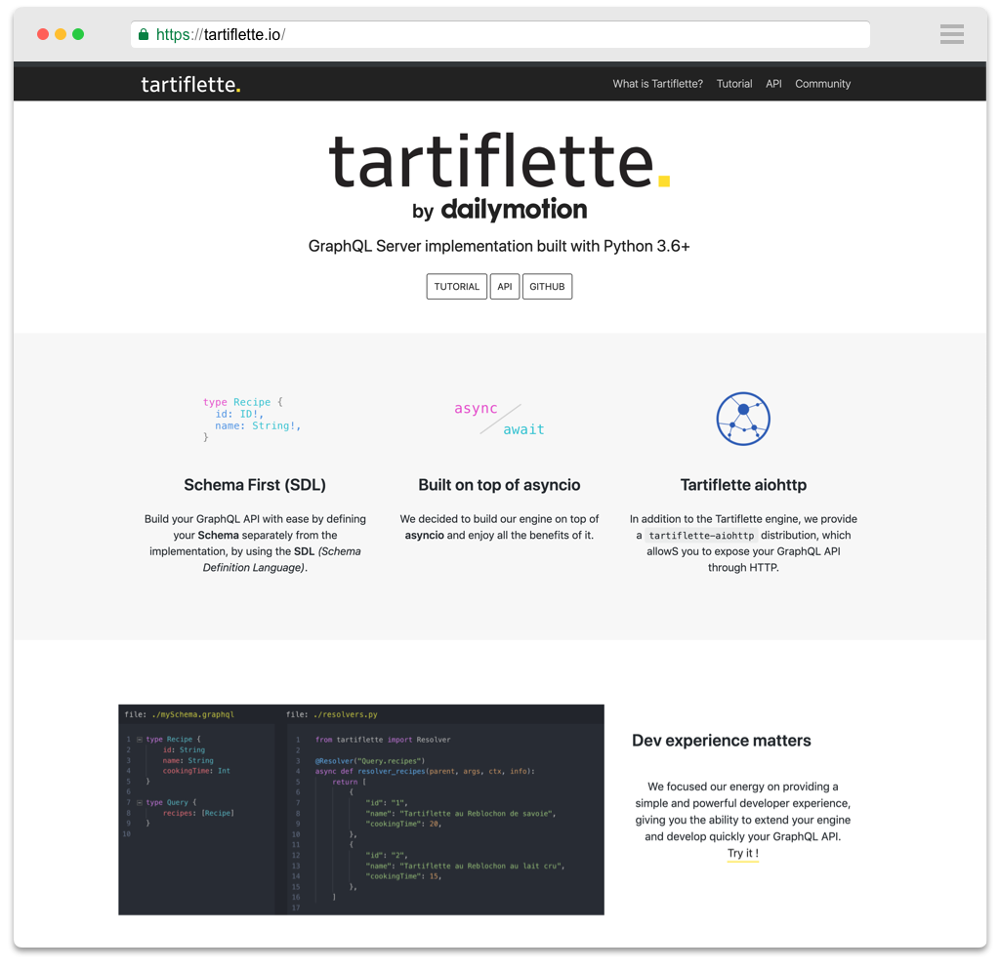

**Tartiflette** is a GraphQL Server implementation built with/for **Python 3.6+**.

This repository contains the [tartiflette](https://github.com/tartiflette/tartiflette) instance of [docusaurus](https://docusaurus.io). You will find only the HTML/CSS files, the skeleton of the tartiflette.io website, not its content. If you want to contribute to the content _(API/Tutorial)_, please refer to the `docs` folder of the tartiflette repository -> [https://github.com/tartiflette/tartiflette/tree/master/docs](https://github.com/tartiflette/tartiflette/tree/master/docs).



## How to run the website locally?

```bash
git clone git@github.com:tartiflette/tartiflette.io.git
cd tartiflette.io
make import-docs
make run
```

## How to pin a new version

```bash
git clone git@github.com:tartiflette/tartiflette.io.git
cd tartiflette.io
./create-new-version.sh 1.1.0
git commit -a -m "doc: new version 1.1.0"
```